# TypeIt — Diagrams

*Visual reference for the finished application (2.0 plus the 2.1 text sources). Every diagram
describes the **target** design, not the current codebase.*

Diagrams render natively on GitHub and in the docs site. Where a diagram and prose disagree, the
prose document named beneath it wins — these are a map, not the territory.

**Contents**

| # | Group | Diagrams |
|---|---|---|
| 1 | [Architecture](#1-architecture) | Layering, target graph, phase dependencies |
| 2 | [Domain classes](#2-domain-classes-typeitcore) | Text, session, metrics |
| 3 | [Modes and text supply](#3-modes-and-text-supply) | `IMode`, `ITextProvider`, race |
| 4 | [Application and ports](#4-application-layer-and-ports) | Services, ports |
| 5 | [Infrastructure](#5-infrastructure-adapters) | Adapters |
| 6 | [Ingestion](#6-ingestion-pipeline) | Fetchers, extractors |
| 7 | [Database](#7-database-schema) | ER, v1 and v2 |
| 8 | [TUI](#8-terminal-frontend) | Screens, widgets, theming |
| 9 | [Sequences](#9-sequences) | Startup, run, race, import, resize, headless |
| 10 | [State machines](#10-state-machines) | Session, grapheme, race ramp |
| 11 | [Flows](#11-decision-and-data-flows) | Metrics, capabilities, navigation, drill loop |
| 12 | [Pipeline](#12-cicd-and-versioning) | CI, release gates, version choice, branches |

---

## 1. Architecture

### 1.1 Layering — ports and adapters

Dependencies point inward only. `typeit::core` links the standard library and nothing else.

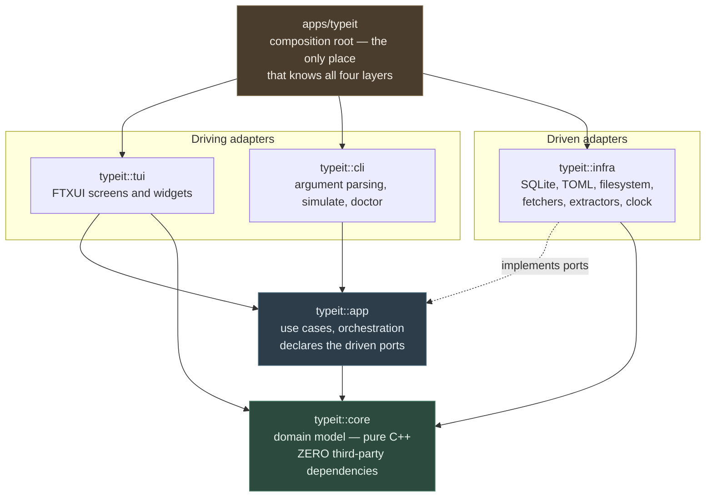
```mermaid
flowchart TB
    subgraph driving["Driving adapters"]
        TUI["typeit::tui<br/>FTXUI screens and widgets"]
        CLI["typeit::cli<br/>argument parsing, simulate, doctor"]
    end

    ROOT["apps/typeit<br/>composition root — the only place<br/>that knows all four layers"]

    APP["typeit::app<br/>use cases, orchestration<br/>declares the driven ports"]
    CORE["typeit::core<br/>domain model — pure C++<br/>ZERO third-party dependencies"]

    subgraph driven["Driven adapters"]
        INFRA["typeit::infra<br/>SQLite, TOML, filesystem,<br/>fetchers, extractors, clock"]
    end

    ROOT --> TUI
    ROOT --> CLI
    ROOT --> INFRA
    TUI --> APP
    CLI --> APP
    APP --> CORE
    TUI --> CORE
    INFRA -. implements ports .-> APP
    INFRA --> CORE

    style CORE fill:#2d4a3e,stroke:#4a7a63,color:#e8f5ee
    style APP fill:#2d3d4a,stroke:#4a6a7a,color:#e8f0f5
    style ROOT fill:#4a3d2d,stroke:#7a6a4a,color:#f5f0e8
```

> [ARCHITECTURE §2](ARCHITECTURE.md#2-style-ports-and-adapters)

### 1.2 CMake target graph

The dependency rule is enforced here, not by review: `typeit_core` has nothing on its
`target_link_libraries`, so FTXUI's include directories are not visible to it and
`#include <ftxui/...>` inside `core` is a **compile error**.

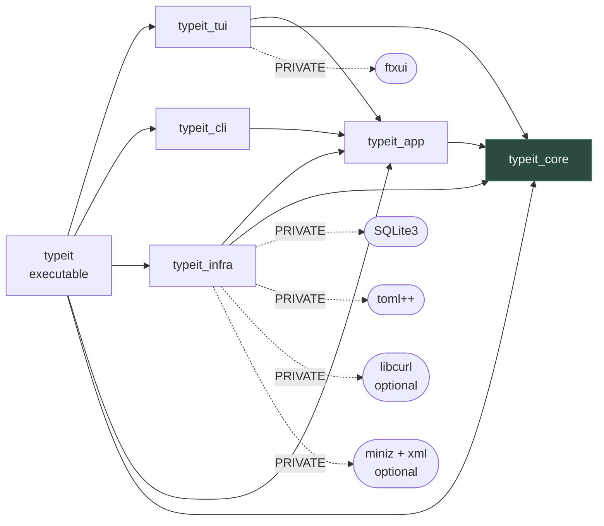
```mermaid
flowchart LR
    EXE["typeit<br/>executable"]
    TUI[typeit_tui]
    CLI[typeit_cli]
    INFRA[typeit_infra]
    APP[typeit_app]
    CORE[typeit_core]

    FTXUI(["ftxui"])
    SQLITE(["SQLite3"])
    TOML(["toml++"])
    CURL(["libcurl<br/>optional"])
    MINIZ(["miniz + xml<br/>optional"])

    EXE --> TUI & CLI & INFRA & APP & CORE
    TUI --> APP --> CORE
    TUI --> CORE
    CLI --> APP
    INFRA --> APP
    INFRA --> CORE

    TUI -. PRIVATE .-> FTXUI
    INFRA -. PRIVATE .-> SQLITE
    INFRA -. PRIVATE .-> TOML
    INFRA -. PRIVATE .-> CURL
    INFRA -. PRIVATE .-> MINIZ

    style CORE fill:#2d4a3e,stroke:#4a7a63,color:#e8f5ee
```

> [BUILD §3](BUILD.md#3-project-structure)

### 1.3 Phase dependencies

No dates are implied — this is ordering, not a schedule.

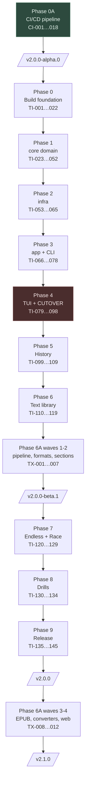
```mermaid
flowchart TD
    P0A["Phase 0A<br/>CI/CD pipeline<br/>CI-001…018"]
    P0["Phase 0<br/>Build foundation<br/>TI-001…022"]
    P1["Phase 1<br/>core domain<br/>TI-023…052"]
    P2["Phase 2<br/>infra<br/>TI-053…065"]
    P3["Phase 3<br/>app + CLI<br/>TI-066…078"]
    P4["Phase 4<br/>TUI + CUTOVER<br/>TI-079…098"]
    P5["Phase 5<br/>History<br/>TI-099…109"]
    P6["Phase 6<br/>Text library<br/>TI-110…119"]
    P6A1["Phase 6A waves 1-2<br/>pipeline, formats, sections<br/>TX-001…007"]
    P7["Phase 7<br/>Endless + Race<br/>TI-120…129"]
    P8["Phase 8<br/>Drills<br/>TI-130…134"]
    P9["Phase 9<br/>Release<br/>TI-135…145"]
    P6A2["Phase 6A waves 3-4<br/>EPUB, converters, web<br/>TX-008…012"]

    V0[/"v2.0.0-alpha.0"/]
    VBETA[/"v2.0.0-beta.1"/]
    V2[/"v2.0.0"/]
    V21[/"v2.1.0"/]

    P0A --> V0 --> P0 --> P1 --> P2 --> P3 --> P4
    P4 --> P5 --> P6 --> P6A1 --> VBETA --> P7 --> P8 --> P9 --> V2 --> P6A2 --> V21

    style P4 fill:#4a2d2d,stroke:#7a4a4a,color:#f5e8e8
    style P0A fill:#2d4a3e,stroke:#4a7a63,color:#e8f5ee
```

> [ROADMAP.md](ROADMAP.md)

---

## 2. Domain classes — `typeit::core`

### 2.1 Text model

Wrapping is a **pure function**, deliberately not state stored on the buffer. That is what makes
a terminal resize a matter of calling it again rather than rebuilding the session.

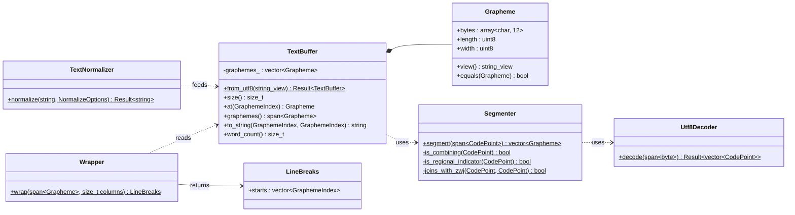
```mermaid
classDiagram
    direction LR

    class Grapheme {
        +bytes : array~char, 12~
        +length : uint8
        +width : uint8
        +view() string_view
        +equals(Grapheme) bool
    }

    class TextBuffer {
        -graphemes_ : vector~Grapheme~
        +from_utf8(string_view) Result~TextBuffer~$
        +size() size_t
        +at(GraphemeIndex) Grapheme
        +graphemes() span~Grapheme~
        +to_string(GraphemeIndex, GraphemeIndex) string
        +word_count() size_t
    }

    class Segmenter {
        +segment(span~CodePoint~) vector~Grapheme~$
        -is_combining(CodePoint) bool$
        -is_regional_indicator(CodePoint) bool$
        -joins_with_zwj(CodePoint, CodePoint) bool$
    }

    class Utf8Decoder {
        +decode(span~byte~) Result~vector~CodePoint~~$
    }

    class Wrapper {
        +wrap(span~Grapheme~, size_t columns) LineBreaks$
    }

    class LineBreaks {
        +starts : vector~GraphemeIndex~
    }

    class TextNormalizer {
        +normalize(string, NormalizeOptions) Result~string~$
    }

    TextBuffer *-- Grapheme
    TextBuffer ..> Segmenter : uses
    Segmenter ..> Utf8Decoder : uses
    Wrapper ..> TextBuffer : reads
    Wrapper --> LineBreaks : returns
    TextNormalizer ..> TextBuffer : feeds
```

> [TECHNICAL §1.4](TECHNICAL.md#14-text-coretext) · [ADR-004](ARCHITECTURE.md#adr-004--text-is-a-sequence-of-grapheme-clusters-not-bytes)

### 2.2 Session and metrics

The keystroke log is the single source of truth; every metric is a pure function over it. That
is what makes the accuracy defect in the current code unrepresentable rather than merely fixed.

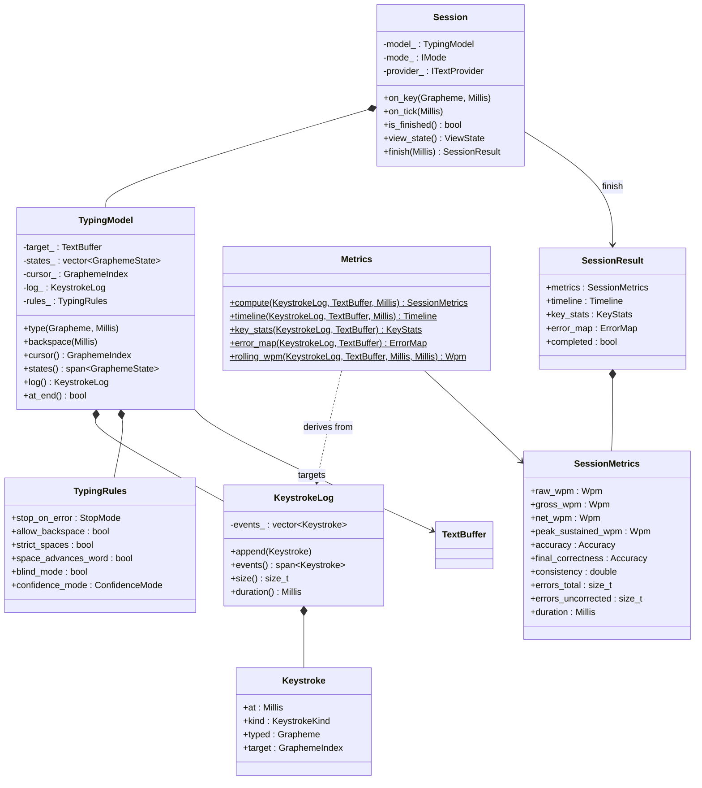
```mermaid
classDiagram
    direction TB

    class Keystroke {
        +at : Millis
        +kind : KeystrokeKind
        +typed : Grapheme
        +target : GraphemeIndex
    }

    class KeystrokeLog {
        -events_ : vector~Keystroke~
        +append(Keystroke)
        +events() span~Keystroke~
        +size() size_t
        +duration() Millis
    }

    class TypingModel {
        -target_ : TextBuffer
        -states_ : vector~GraphemeState~
        -cursor_ : GraphemeIndex
        -log_ : KeystrokeLog
        -rules_ : TypingRules
        +type(Grapheme, Millis)
        +backspace(Millis)
        +cursor() GraphemeIndex
        +states() span~GraphemeState~
        +log() KeystrokeLog
        +at_end() bool
    }

    class TypingRules {
        +stop_on_error : StopMode
        +allow_backspace : bool
        +strict_spaces : bool
        +space_advances_word : bool
        +blind_mode : bool
        +confidence_mode : ConfidenceMode
    }

    class Session {
        -model_ : TypingModel
        -mode_ : IMode
        -provider_ : ITextProvider
        +on_key(Grapheme, Millis)
        +on_tick(Millis)
        +is_finished() bool
        +view_state() ViewState
        +finish(Millis) SessionResult
    }

    class Metrics {
        +compute(KeystrokeLog, TextBuffer, Millis) SessionMetrics$
        +timeline(KeystrokeLog, TextBuffer, Millis) Timeline$
        +key_stats(KeystrokeLog, TextBuffer) KeyStats$
        +error_map(KeystrokeLog, TextBuffer) ErrorMap$
        +rolling_wpm(KeystrokeLog, TextBuffer, Millis, Millis) Wpm$
    }

    class SessionMetrics {
        +raw_wpm : Wpm
        +gross_wpm : Wpm
        +net_wpm : Wpm
        +peak_sustained_wpm : Wpm
        +accuracy : Accuracy
        +final_correctness : Accuracy
        +consistency : double
        +errors_total : size_t
        +errors_uncorrected : size_t
        +duration : Millis
    }

    class SessionResult {
        +metrics : SessionMetrics
        +timeline : Timeline
        +key_stats : KeyStats
        +error_map : ErrorMap
        +completed : bool
    }

    KeystrokeLog *-- Keystroke
    TypingModel *-- KeystrokeLog
    TypingModel *-- TypingRules
    TypingModel --> TextBuffer : targets
    Session *-- TypingModel
    Metrics ..> KeystrokeLog : derives from
    Metrics --> SessionMetrics
    Session --> SessionResult : finish
    SessionResult *-- SessionMetrics
```

> [TECHNICAL §1.5–1.7](TECHNICAL.md#15-the-keystroke-log-coresession) · [ADR-002](ARCHITECTURE.md#adr-002--the-keystroke-log-is-the-single-source-of-truth-all-metrics-are-derived)

---

## 3. Modes and text supply

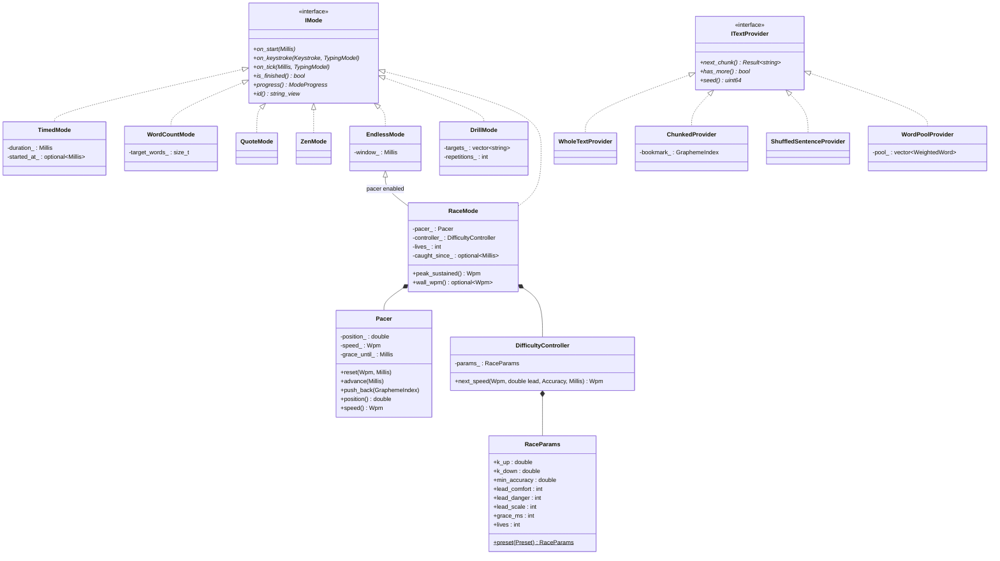
```mermaid
classDiagram
    direction TB

    class IMode {
        <<interface>>
        +on_start(Millis)*
        +on_keystroke(Keystroke, TypingModel)*
        +on_tick(Millis, TypingModel)*
        +is_finished() bool*
        +progress() ModeProgress*
        +id() string_view*
    }

    class TimedMode {
        -duration_ : Millis
        -started_at_ : optional~Millis~
    }
    class WordCountMode {
        -target_words_ : size_t
    }
    class QuoteMode
    class ZenMode
    class EndlessMode {
        -window_ : Millis
    }
    class DrillMode {
        -targets_ : vector~string~
        -repetitions_ : int
    }
    class RaceMode {
        -pacer_ : Pacer
        -controller_ : DifficultyController
        -lives_ : int
        -caught_since_ : optional~Millis~
        +peak_sustained() Wpm
        +wall_wpm() optional~Wpm~
    }

    class Pacer {
        -position_ : double
        -speed_ : Wpm
        -grace_until_ : Millis
        +reset(Wpm, Millis)
        +advance(Millis)
        +push_back(GraphemeIndex)
        +position() double
        +speed() Wpm
    }

    class DifficultyController {
        -params_ : RaceParams
        +next_speed(Wpm, double lead, Accuracy, Millis) Wpm
    }

    class RaceParams {
        +k_up : double
        +k_down : double
        +min_accuracy : double
        +lead_comfort : int
        +lead_danger : int
        +lead_scale : int
        +grace_ms : int
        +lives : int
        +preset(Preset) RaceParams$
    }

    class ITextProvider {
        <<interface>>
        +next_chunk() Result~string~*
        +has_more() bool*
        +seed() uint64*
    }

    class WholeTextProvider
    class ChunkedProvider {
        -bookmark_ : GraphemeIndex
    }
    class ShuffledSentenceProvider
    class WordPoolProvider {
        -pool_ : vector~WeightedWord~
    }

    IMode <|.. TimedMode
    IMode <|.. WordCountMode
    IMode <|.. QuoteMode
    IMode <|.. ZenMode
    IMode <|.. EndlessMode
    IMode <|.. DrillMode
    IMode <|.. RaceMode
    EndlessMode <|-- RaceMode : pacer enabled

    RaceMode *-- Pacer
    RaceMode *-- DifficultyController
    DifficultyController *-- RaceParams

    ITextProvider <|.. WholeTextProvider
    ITextProvider <|.. ChunkedProvider
    ITextProvider <|.. ShuffledSentenceProvider
    ITextProvider <|.. WordPoolProvider
```

> [GAMEPLAY §2–3](GAMEPLAY.md#2-modes) · [ADR-008](ARCHITECTURE.md#adr-008--game-modes-are-strategies-behind-one-interface)

---

## 4. Application layer and ports

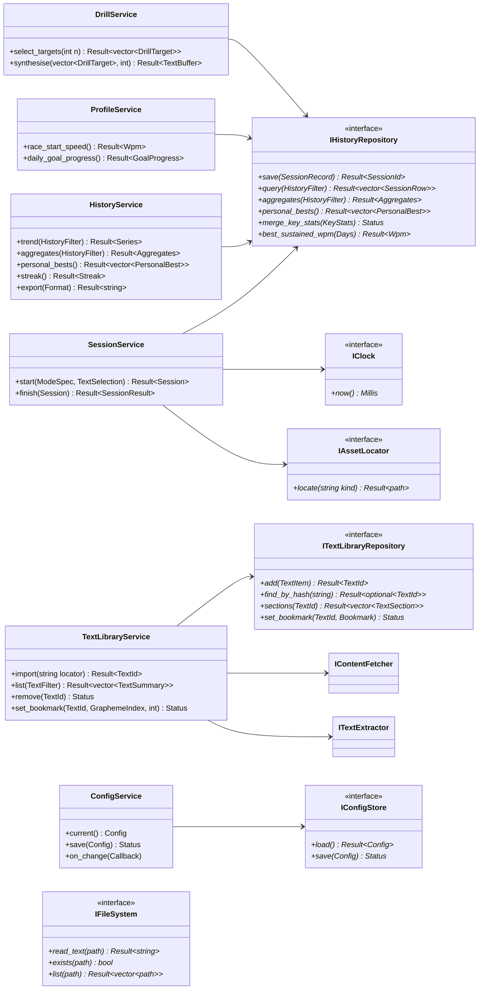
```mermaid
classDiagram
    direction LR

    class SessionService {
        +start(ModeSpec, TextSelection) Result~Session~
        +finish(Session) Result~SessionResult~
    }
    class HistoryService {
        +trend(HistoryFilter) Result~Series~
        +aggregates(HistoryFilter) Result~Aggregates~
        +personal_bests() Result~vector~PersonalBest~~
        +streak() Result~Streak~
        +export(Format) Result~string~
    }
    class TextLibraryService {
        +import(string locator) Result~TextId~
        +list(TextFilter) Result~vector~TextSummary~~
        +remove(TextId) Status
        +set_bookmark(TextId, GraphemeIndex, int) Status
    }
    class ProfileService {
        +race_start_speed() Result~Wpm~
        +daily_goal_progress() Result~GoalProgress~
    }
    class DrillService {
        +select_targets(int n) Result~vector~DrillTarget~~
        +synthesise(vector~DrillTarget~, int) Result~TextBuffer~
    }
    class ConfigService {
        +current() Config
        +save(Config) Status
        +on_change(Callback)
    }

    class IHistoryRepository {
        <<interface>>
        +save(SessionRecord) Result~SessionId~*
        +query(HistoryFilter) Result~vector~SessionRow~~*
        +aggregates(HistoryFilter) Result~Aggregates~*
        +personal_bests() Result~vector~PersonalBest~~*
        +merge_key_stats(KeyStats) Status*
        +best_sustained_wpm(Days) Result~Wpm~*
    }
    class ITextLibraryRepository {
        <<interface>>
        +add(TextItem) Result~TextId~*
        +find_by_hash(string) Result~optional~TextId~~*
        +sections(TextId) Result~vector~TextSection~~*
        +set_bookmark(TextId, Bookmark) Status*
    }
    class IConfigStore {
        <<interface>>
        +load() Result~Config~*
        +save(Config) Status*
    }
    class IAssetLocator {
        <<interface>>
        +locate(string kind) Result~path~*
    }
    class IFileSystem {
        <<interface>>
        +read_text(path) Result~string~*
        +exists(path) bool*
        +list(path) Result~vector~path~~*
    }
    class IClock {
        <<interface>>
        +now() Millis*
    }

    SessionService --> IHistoryRepository
    SessionService --> IClock
    HistoryService --> IHistoryRepository
    TextLibraryService --> ITextLibraryRepository
    TextLibraryService --> IContentFetcher
    TextLibraryService --> ITextExtractor
    ProfileService --> IHistoryRepository
    DrillService --> IHistoryRepository
    ConfigService --> IConfigStore
    SessionService --> IAssetLocator
```

> [TECHNICAL §2](TECHNICAL.md#2-application-layer)

---

## 5. Infrastructure adapters

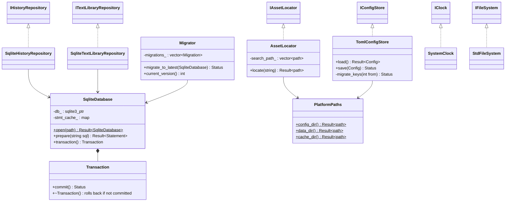
```mermaid
classDiagram
    direction TB

    class SqliteDatabase {
        -db_ : sqlite3_ptr
        -stmt_cache_ : map
        +open(path) Result~SqliteDatabase~$
        +prepare(string sql) Result~Statement~
        +transaction() Transaction
    }
    class Transaction {
        +commit() Status
        +~Transaction() rolls back if not committed
    }
    class Migrator {
        +migrate_to_latest(SqliteDatabase) Status
        +current_version() int
        -migrations_ : vector~Migration~
    }
    class SqliteHistoryRepository
    class SqliteTextLibraryRepository
    class TomlConfigStore {
        +load() Result~Config~
        +save(Config) Status
        -migrate_keys(int from) Status
    }
    class PlatformPaths {
        +config_dir() Result~path~$
        +data_dir() Result~path~$
        +cache_dir() Result~path~$
    }
    class AssetLocator {
        -search_path_ : vector~path~
        +locate(string) Result~path~
    }
    class SystemClock
    class StdFileSystem

    IHistoryRepository <|.. SqliteHistoryRepository
    ITextLibraryRepository <|.. SqliteTextLibraryRepository
    IConfigStore <|.. TomlConfigStore
    IAssetLocator <|.. AssetLocator
    IFileSystem <|.. StdFileSystem
    IClock <|.. SystemClock

    SqliteHistoryRepository --> SqliteDatabase
    SqliteTextLibraryRepository --> SqliteDatabase
    SqliteDatabase *-- Transaction
    Migrator --> SqliteDatabase
    AssetLocator --> PlatformPaths
    TomlConfigStore --> PlatformPaths
```

> [TECHNICAL §4](TECHNICAL.md#4-infrastructure)

---

## 6. Ingestion pipeline

Getting content *in* and serving text *during a run* are different problems. The original
`ITextSource` conflated them; separating them is what makes a new format one new class.

```mermaid
flowchart LR
    subgraph acq["Acquisition — IContentFetcher"]
        F1[FileFetcher]
        F2[StdinFetcher]
        F3[PasteFetcher]
        F4[DirectoryFetcher]
        F5["HttpFetcher<br/>optional build"]
    end

    subgraph ext["Extraction — ITextExtractor"]
        E1[PlainText]
        E2[Markdown]
        E3[Html]
        E4[Epub]
        E5[Subtitle]
        E6[Code]
        E7[Docx]
        E8["ExternalCommand<br/>pandoc, pdftotext"]
    end

    subgraph norm["Normalisation — core, pure"]
        N1[TextNormalizer]
        N2["TypingReadiness<br/>dehyphenate, drop heads,<br/>rejoin paragraphs"]
    end

    LOC(["locator<br/>path, URL, stdin"]) --> acq
    acq -->|"FetchedContent<br/>bytes + MIME"| REG{{ExtractorRegistry}}
    REG --> ext
    ext -->|"ExtractedText<br/>text + sections"| norm
    norm --> HASH["SHA-256<br/>dedup"]
    HASH --> DB[("text_item<br/>text_section")]
    DB --> PROV["ITextProvider<br/>serves text during a run"]

    style F5 stroke-dasharray: 5 5
    style E8 stroke-dasharray: 5 5
```

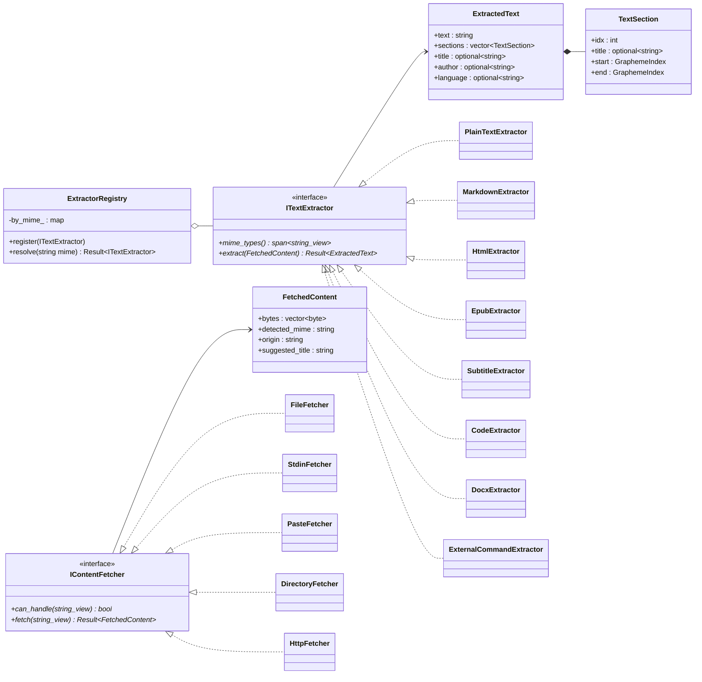
```mermaid
classDiagram
    direction LR

    class IContentFetcher {
        <<interface>>
        +can_handle(string_view) bool*
        +fetch(string_view) Result~FetchedContent~*
    }
    class ITextExtractor {
        <<interface>>
        +mime_types() span~string_view~*
        +extract(FetchedContent) Result~ExtractedText~*
    }
    class ExtractorRegistry {
        -by_mime_ : map
        +register(ITextExtractor)
        +resolve(string mime) Result~ITextExtractor~
    }
    class FetchedContent {
        +bytes : vector~byte~
        +detected_mime : string
        +origin : string
        +suggested_title : string
    }
    class ExtractedText {
        +text : string
        +sections : vector~TextSection~
        +title : optional~string~
        +author : optional~string~
        +language : optional~string~
    }
    class TextSection {
        +idx : int
        +title : optional~string~
        +start : GraphemeIndex
        +end : GraphemeIndex
    }

    IContentFetcher <|.. FileFetcher
    IContentFetcher <|.. StdinFetcher
    IContentFetcher <|.. PasteFetcher
    IContentFetcher <|.. DirectoryFetcher
    IContentFetcher <|.. HttpFetcher

    ITextExtractor <|.. PlainTextExtractor
    ITextExtractor <|.. MarkdownExtractor
    ITextExtractor <|.. HtmlExtractor
    ITextExtractor <|.. EpubExtractor
    ITextExtractor <|.. SubtitleExtractor
    ITextExtractor <|.. CodeExtractor
    ITextExtractor <|.. DocxExtractor
    ITextExtractor <|.. ExternalCommandExtractor

    IContentFetcher --> FetchedContent
    ITextExtractor --> ExtractedText
    ExtractedText *-- TextSection
    ExtractorRegistry o-- ITextExtractor
```

> [TEXT_SOURCES.md](TEXT_SOURCES.md) · [ADR-013](ARCHITECTURE.md#adr-013--ingestion-is-a-three-stage-pipeline-separate-from-text-supply)

---

## 7. Database schema

Schema v1 in solid relationships; v2 additions marked in the notes below.

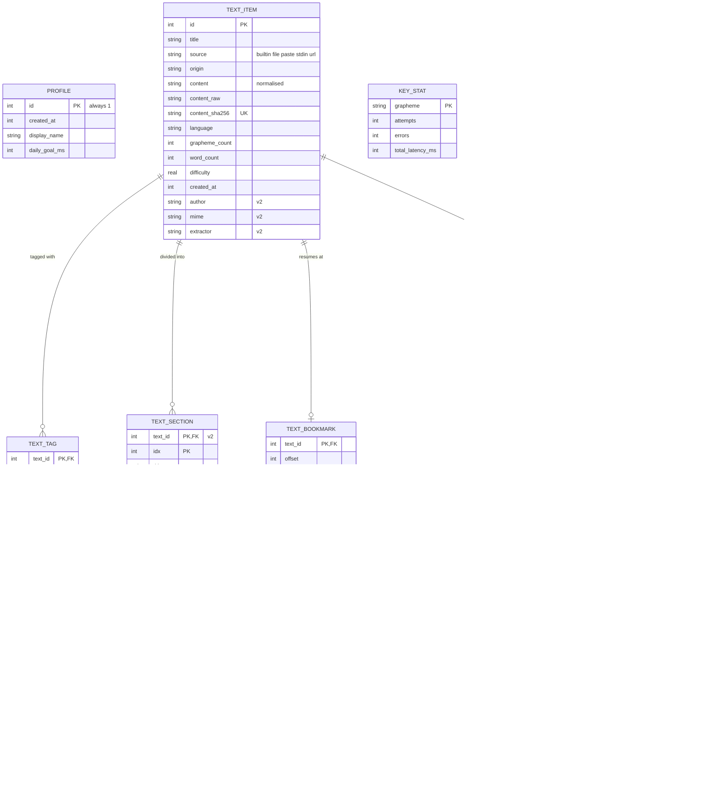
```mermaid
erDiagram
    PROFILE {
        int id PK "always 1"
        int created_at
        string display_name
        int daily_goal_ms
    }

    TEXT_ITEM {
        int id PK
        string title
        string source "builtin file paste stdin url"
        string origin
        string content "normalised"
        string content_raw
        string content_sha256 UK
        string language
        int grapheme_count
        int word_count
        real difficulty
        int created_at
        string author "v2"
        string mime "v2"
        string extractor "v2"
    }

    TEXT_TAG {
        int text_id PK,FK
        string tag PK
    }

    TEXT_SECTION {
        int text_id PK,FK "v2"
        int idx PK
        string title
        int start_idx
        int end_idx
    }

    TEXT_BOOKMARK {
        int text_id PK,FK
        int offset
        int section_idx "v2"
        int updated_at
    }

    SESSION {
        int id PK
        int started_at
        int ended_at
        string mode
        string mode_param "JSON"
        int text_id FK
        string provider
        int provider_seed "reproduces the stream"
        int duration_ms
        int graphemes_typed
        int graphemes_correct
        int errors_total
        int errors_uncorrected
        int backspaces
        real raw_wpm
        real gross_wpm
        real net_wpm
        real accuracy
        real final_correctness
        real consistency
        real peak_wpm "race"
        real wall_wpm "race"
        int completed
        string app_version
    }

    SESSION_SAMPLE {
        int session_id PK,FK
        int t_ms PK
        real wpm
        int errors
        real pacer_wpm
    }

    KEYSTROKE_BLOB {
        int session_id PK,FK
        string encoding
        blob data
    }

    KEY_STAT {
        string grapheme PK
        int attempts
        int errors
        int total_latency_ms
    }

    BIGRAM_STAT {
        string bigram PK
        int attempts
        int errors
        int total_latency_ms
    }

    ERROR_PAIR {
        string expected PK
        string typed PK
        int count
    }

    PERSONAL_BEST {
        string mode PK
        string param PK
        string metric PK
        int session_id FK
        real value
        int achieved_at
    }

    TEXT_ITEM ||--o{ TEXT_TAG : "tagged with"
    TEXT_ITEM ||--o{ TEXT_SECTION : "divided into"
    TEXT_ITEM ||--o| TEXT_BOOKMARK : "resumes at"
    TEXT_ITEM ||--o{ SESSION : "typed in"
    SESSION ||--o{ SESSION_SAMPLE : "sampled per second"
    SESSION ||--o| KEYSTROKE_BLOB : "optional replay log"
    SESSION ||--o{ PERSONAL_BEST : "holds"
```

`KEY_STAT`, `BIGRAM_STAT`, and `ERROR_PAIR` are lifetime aggregates merged per session rather
than per-session rows — they intentionally have no foreign key to `SESSION`.

> [TECHNICAL §5](TECHNICAL.md#5-database-schema-v1) · [TEXT_SOURCES §9](TEXT_SOURCES.md#9-sections-and-schema)

---

## 8. Terminal frontend

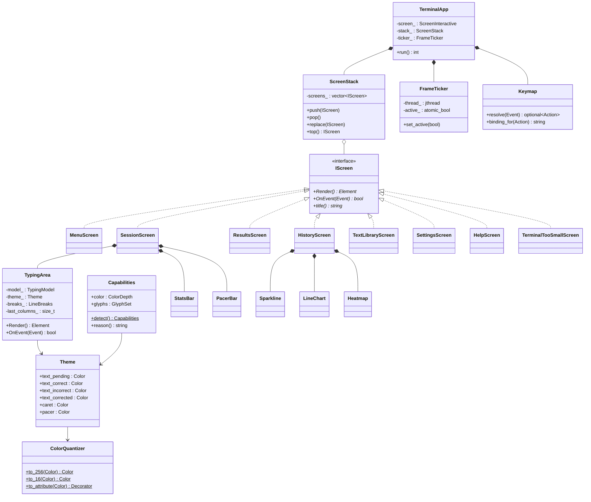
```mermaid
classDiagram
    direction TB

    class TerminalApp {
        -screen_ : ScreenInteractive
        -stack_ : ScreenStack
        -ticker_ : FrameTicker
        +run() int
    }
    class ScreenStack {
        -screens_ : vector~IScreen~
        +push(IScreen)
        +pop()
        +replace(IScreen)
        +top() IScreen
    }
    class IScreen {
        <<interface>>
        +Render() Element*
        +OnEvent(Event) bool*
        +title() string*
    }
    class FrameTicker {
        -thread_ : jthread
        -active_ : atomic_bool
        +set_active(bool)
    }
    class TypingArea {
        -model_ : TypingModel
        -theme_ : Theme
        -breaks_ : LineBreaks
        -last_columns_ : size_t
        +Render() Element
        +OnEvent(Event) bool
    }
    class Theme {
        +text_pending : Color
        +text_correct : Color
        +text_incorrect : Color
        +text_corrected : Color
        +caret : Color
        +pacer : Color
    }
    class Capabilities {
        +color : ColorDepth
        +glyphs : GlyphSet
        +detect() Capabilities$
        +reason() string
    }
    class ColorQuantizer {
        +to_256(Color) Color$
        +to_16(Color) Color$
        +to_attribute(Color) Decorator$
    }
    class Keymap {
        +resolve(Event) optional~Action~
        +binding_for(Action) string
    }

    TerminalApp *-- ScreenStack
    TerminalApp *-- FrameTicker
    ScreenStack o-- IScreen
    IScreen <|.. MenuScreen
    IScreen <|.. SessionScreen
    IScreen <|.. ResultsScreen
    IScreen <|.. HistoryScreen
    IScreen <|.. TextLibraryScreen
    IScreen <|.. SettingsScreen
    IScreen <|.. HelpScreen
    IScreen <|.. TerminalTooSmallScreen

    SessionScreen *-- TypingArea
    SessionScreen *-- StatsBar
    SessionScreen *-- PacerBar
    HistoryScreen *-- Sparkline
    HistoryScreen *-- LineChart
    HistoryScreen *-- Heatmap
    TypingArea --> Theme
    Theme --> ColorQuantizer
    Capabilities --> Theme
    TerminalApp *-- Keymap
```

> [TECHNICAL §3](TECHNICAL.md#3-tui-layer) · [UX.md](UX.md)

---

## 9. Sequences

### 9.1 Startup

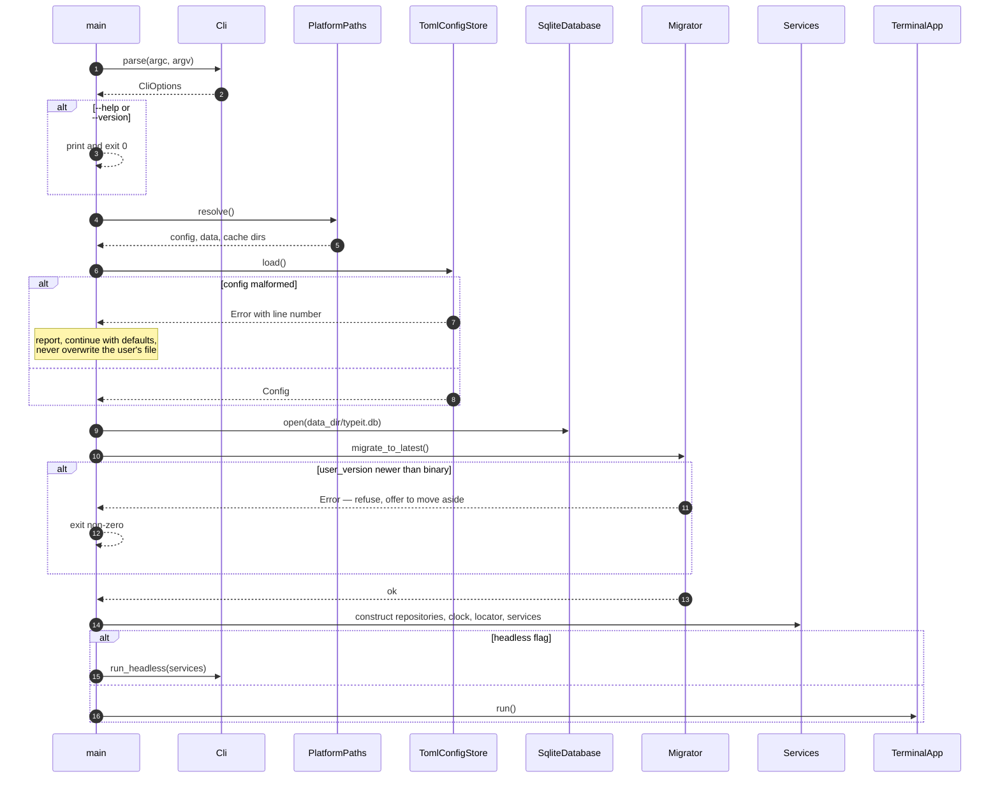
```mermaid
sequenceDiagram
    autonumber
    participant M as main
    participant CLI as Cli
    participant PP as PlatformPaths
    participant CS as TomlConfigStore
    participant DB as SqliteDatabase
    participant MG as Migrator
    participant SV as Services
    participant APP as TerminalApp

    M->>CLI: parse(argc, argv)
    CLI-->>M: CliOptions
    alt --help or --version
        M-->>M: print and exit 0
    end
    M->>PP: resolve()
    PP-->>M: config, data, cache dirs
    M->>CS: load()
    alt config malformed
        CS-->>M: Error with line number
        Note over M: report, continue with defaults,<br/>never overwrite the user's file
    else
        CS-->>M: Config
    end
    M->>DB: open(data_dir/typeit.db)
    M->>MG: migrate_to_latest()
    alt user_version newer than binary
        MG-->>M: Error — refuse, offer to move aside
        M-->>M: exit non-zero
    end
    MG-->>M: ok
    M->>SV: construct repositories, clock, locator, services
    alt headless flag
        M->>CLI: run_headless(services)
    else
        M->>APP: run()
    end
```

> [ARCHITECTURE §5.1](ARCHITECTURE.md#51-startup)

### 9.2 A typing run

The critical property: `core::Session` never touches FTXUI, the clock, or the database. Time
arrives as a parameter; persistence happens above it.

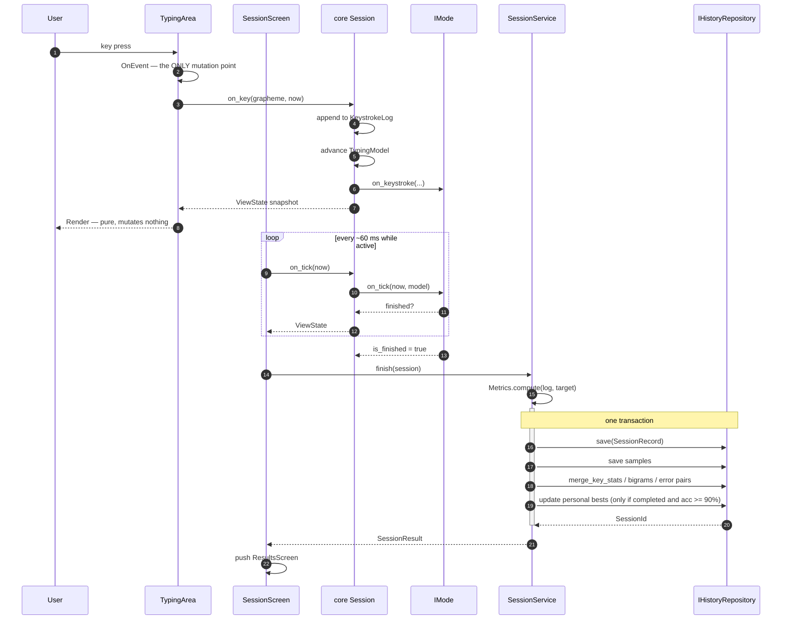
```mermaid
sequenceDiagram
    autonumber
    participant U as User
    participant TA as TypingArea
    participant SS as SessionScreen
    participant S as core Session
    participant MO as IMode
    participant SV as SessionService
    participant R as IHistoryRepository

    U->>TA: key press
    TA->>TA: OnEvent — the ONLY mutation point
    TA->>S: on_key(grapheme, now)
    S->>S: append to KeystrokeLog
    S->>S: advance TypingModel
    S->>MO: on_keystroke(...)
    S-->>TA: ViewState snapshot
    TA-->>U: Render — pure, mutates nothing

    loop every ~60 ms while active
        SS->>S: on_tick(now)
        S->>MO: on_tick(now, model)
        MO-->>S: finished?
        S-->>SS: ViewState
    end

    MO-->>S: is_finished = true
    SS->>SV: finish(session)
    SV->>SV: Metrics.compute(log, target)
    activate SV
    Note over SV,R: one transaction
    SV->>R: save(SessionRecord)
    SV->>R: save samples
    SV->>R: merge_key_stats / bigrams / error pairs
    SV->>R: update personal bests (only if completed and acc >= 90%)
    R-->>SV: SessionId
    deactivate SV
    SV-->>SS: SessionResult
    SS->>SS: push ResultsScreen
```

> [ARCHITECTURE §5.2](ARCHITECTURE.md#52-a-typing-run) · [ADR-003](ARCHITECTURE.md#adr-003--rendering-is-a-pure-function-of-state)

### 9.3 Race mode tick

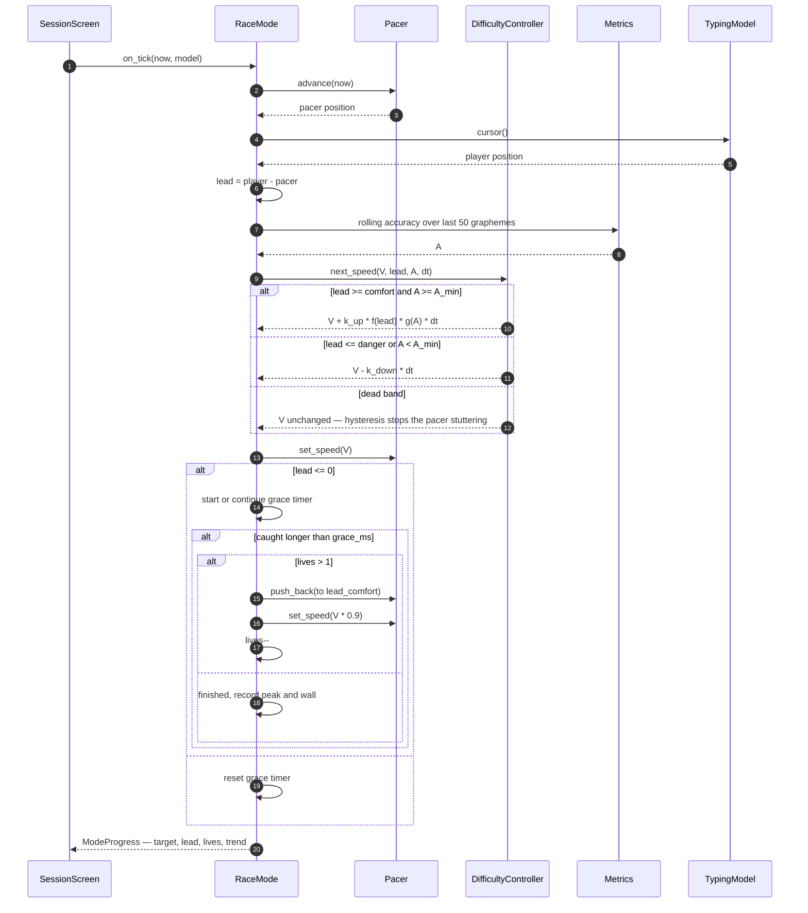
```mermaid
sequenceDiagram
    autonumber
    participant SS as SessionScreen
    participant RM as RaceMode
    participant P as Pacer
    participant DC as DifficultyController
    participant MT as Metrics
    participant TM as TypingModel

    SS->>RM: on_tick(now, model)
    RM->>P: advance(now)
    P-->>RM: pacer position
    RM->>TM: cursor()
    TM-->>RM: player position
    RM->>RM: lead = player - pacer
    RM->>MT: rolling accuracy over last 50 graphemes
    MT-->>RM: A

    RM->>DC: next_speed(V, lead, A, dt)
    alt lead >= comfort and A >= A_min
        DC-->>RM: V + k_up * f(lead) * g(A) * dt
    else lead <= danger or A < A_min
        DC-->>RM: V - k_down * dt
    else dead band
        DC-->>RM: V unchanged — hysteresis stops the pacer stuttering
    end
    RM->>P: set_speed(V)

    alt lead <= 0
        RM->>RM: start or continue grace timer
        alt caught longer than grace_ms
            alt lives > 1
                RM->>P: push_back(to lead_comfort)
                RM->>P: set_speed(V * 0.9)
                RM->>RM: lives--
            else
                RM->>RM: finished, record peak and wall
            end
        end
    else
        RM->>RM: reset grace timer
    end
    RM-->>SS: ModeProgress — target, lead, lives, trend
```

> [GAMEPLAY §3](GAMEPLAY.md#3-race-mode--the-progressive-ramp)

### 9.4 Import a local file

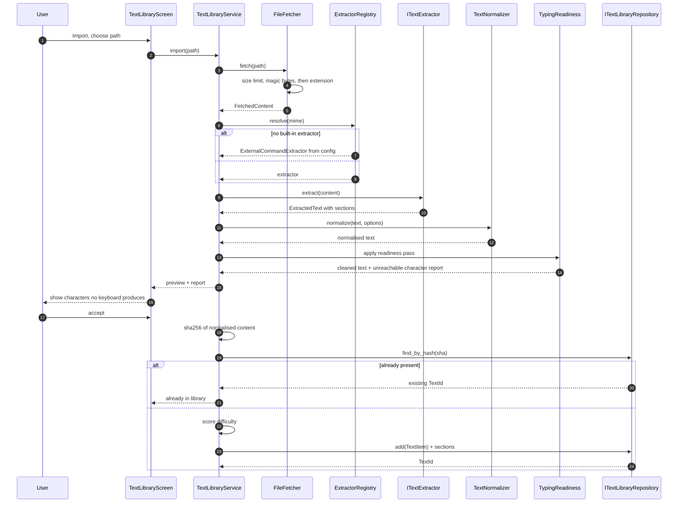
```mermaid
sequenceDiagram
    autonumber
    participant U as User
    participant LS as TextLibraryScreen
    participant TL as TextLibraryService
    participant FF as FileFetcher
    participant RG as ExtractorRegistry
    participant EX as ITextExtractor
    participant NM as TextNormalizer
    participant TR as TypingReadiness
    participant R as ITextLibraryRepository

    U->>LS: Import, choose path
    LS->>TL: import(path)
    TL->>FF: fetch(path)
    FF->>FF: size limit, magic bytes, then extension
    FF-->>TL: FetchedContent
    TL->>RG: resolve(mime)
    alt no built-in extractor
        RG-->>TL: ExternalCommandExtractor from config
    else
        RG-->>TL: extractor
    end
    TL->>EX: extract(content)
    EX-->>TL: ExtractedText with sections
    TL->>NM: normalize(text, options)
    NM-->>TL: normalised text
    TL->>TR: apply readiness pass
    TR-->>TL: cleaned text + unreachable-character report
    TL-->>LS: preview + report
    LS-->>U: show characters no keyboard produces
    U->>LS: accept
    TL->>TL: sha256 of normalised content
    TL->>R: find_by_hash(sha)
    alt already present
        R-->>TL: existing TextId
        TL-->>LS: already in library
    else
        TL->>TL: score difficulty
        TL->>R: add(TextItem) + sections
        R-->>TL: TextId
    end
```

> [TEXT_SOURCES §2](TEXT_SOURCES.md#2-the-pipeline)

### 9.5 Import from the web

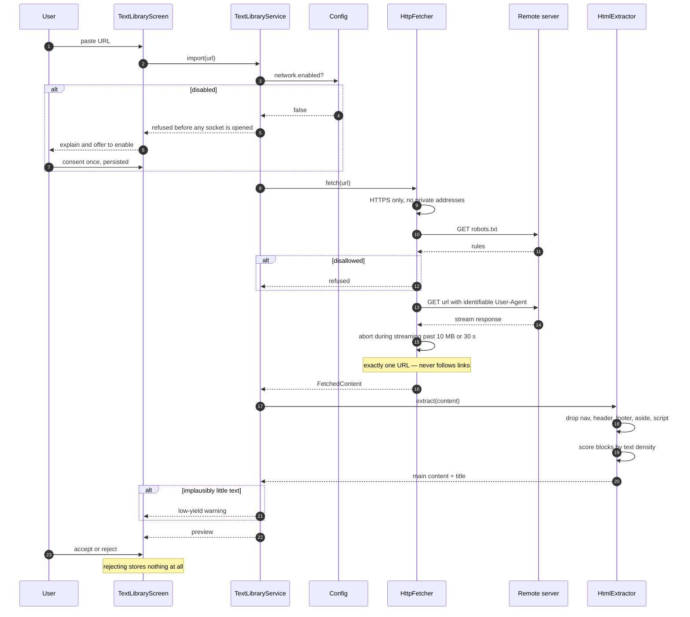
```mermaid
sequenceDiagram
    autonumber
    participant U as User
    participant LS as TextLibraryScreen
    participant TL as TextLibraryService
    participant CF as Config
    participant HF as HttpFetcher
    participant W as Remote server
    participant HE as HtmlExtractor

    U->>LS: paste URL
    LS->>TL: import(url)
    TL->>CF: network.enabled?
    alt disabled
        CF-->>TL: false
        TL-->>LS: refused before any socket is opened
        LS-->>U: explain and offer to enable
        U->>LS: consent once, persisted
    end
    TL->>HF: fetch(url)
    HF->>HF: HTTPS only, no private addresses
    HF->>W: GET robots.txt
    W-->>HF: rules
    alt disallowed
        HF-->>TL: refused
    end
    HF->>W: GET url with identifiable User-Agent
    W-->>HF: stream response
    HF->>HF: abort during streaming past 10 MB or 30 s
    Note over HF: exactly one URL — never follows links
    HF-->>TL: FetchedContent
    TL->>HE: extract(content)
    HE->>HE: drop nav, header, footer, aside, script
    HE->>HE: score blocks by text density
    HE-->>TL: main content + title
    alt implausibly little text
        TL-->>LS: low-yield warning
    end
    TL-->>LS: preview
    U->>LS: accept or reject
    Note over LS: rejecting stores nothing at all
```

> [TEXT_SOURCES §5–6](TEXT_SOURCES.md#5-html-extraction) · [ADR-014](ARCHITECTURE.md#adr-014--network-access-is-optional-at-build-time-and-opt-in-at-runtime)

### 9.6 Headless simulation

The proof that the layering is real: a complete session, measured and persisted, with no
terminal.

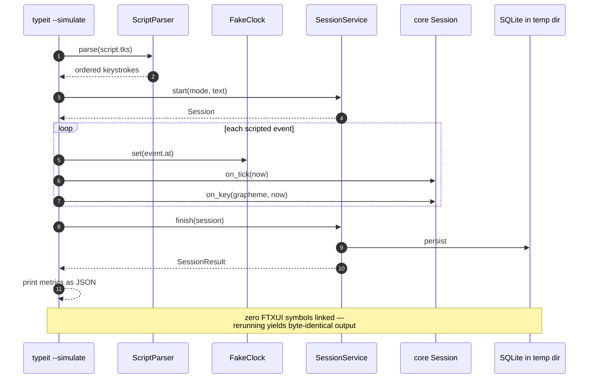
```mermaid
sequenceDiagram
    autonumber
    participant CLI as typeit --simulate
    participant SP as ScriptParser
    participant FC as FakeClock
    participant SV as SessionService
    participant S as core Session
    participant R as SQLite in temp dir

    CLI->>SP: parse(script.tks)
    SP-->>CLI: ordered keystrokes
    CLI->>SV: start(mode, text)
    SV-->>CLI: Session
    loop each scripted event
        CLI->>FC: set(event.at)
        CLI->>S: on_tick(now)
        CLI->>S: on_key(grapheme, now)
    end
    CLI->>SV: finish(session)
    SV->>R: persist
    SV-->>CLI: SessionResult
    CLI-->>CLI: print metrics as JSON
    Note over CLI,R: zero FTXUI symbols linked —<br/>rerunning yields byte-identical output
```

> [TECHNICAL §7](TECHNICAL.md#7-command-line-interface) · [TESTING §7](TESTING.md#7-end-to-end-tests)

### 9.7 Terminal resize mid-session

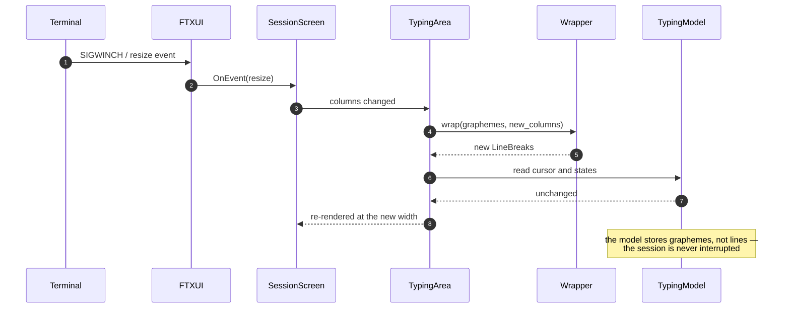
```mermaid
sequenceDiagram
    autonumber
    participant T as Terminal
    participant FT as FTXUI
    participant SS as SessionScreen
    participant TA as TypingArea
    participant W as Wrapper
    participant TM as TypingModel

    T->>FT: SIGWINCH / resize event
    FT->>SS: OnEvent(resize)
    SS->>TA: columns changed
    TA->>W: wrap(graphemes, new_columns)
    W-->>TA: new LineBreaks
    TA->>TM: read cursor and states
    TM-->>TA: unchanged
    TA-->>SS: re-rendered at the new width
    Note over TM: the model stores graphemes, not lines —<br/>the session is never interrupted
```

> [UX §6.4](UX.md#64-resize) · [ADR-001](ARCHITECTURE.md#adr-001--typeitcore-has-zero-third-party-dependencies)

---

## 10. State machines

### 10.1 Session lifecycle

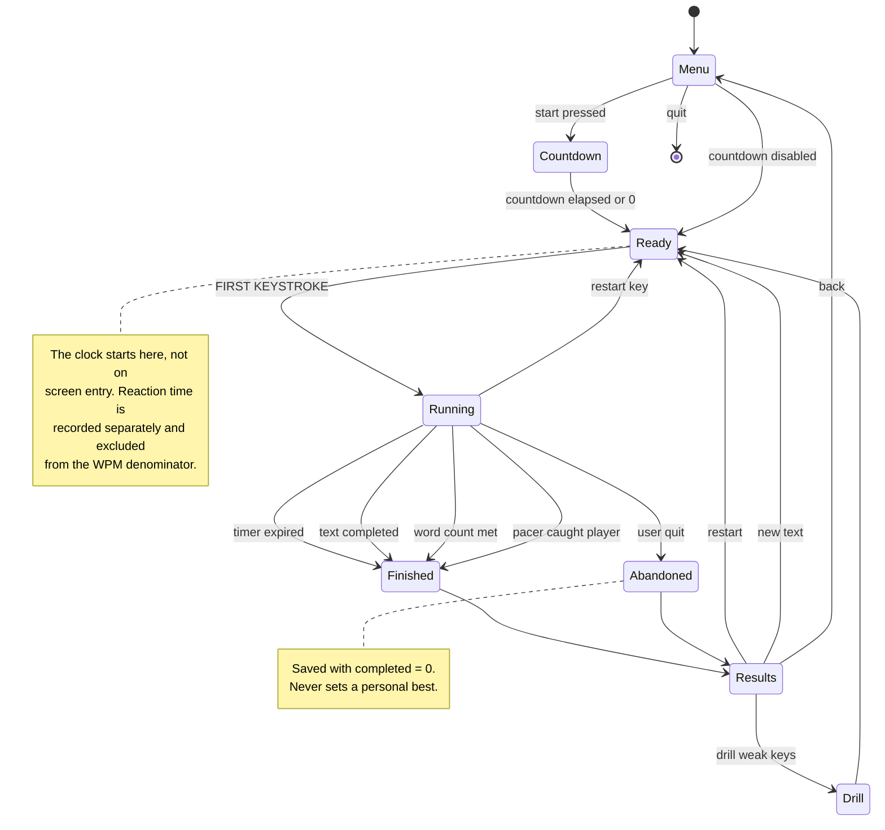
```mermaid
stateDiagram-v2
    [*] --> Menu
    Menu --> Countdown : start pressed
    Countdown --> Ready : countdown elapsed or 0
    Menu --> Ready : countdown disabled

    Ready --> Running : FIRST KEYSTROKE
    note right of Ready
        The clock starts here, not on
        screen entry. Reaction time is
        recorded separately and excluded
        from the WPM denominator.
    end note

    Running --> Finished : timer expired
    Running --> Finished : text completed
    Running --> Finished : word count met
    Running --> Finished : pacer caught player
    Running --> Abandoned : user quit
    Running --> Ready : restart key

    Finished --> Results
    Abandoned --> Results

    Results --> Ready : restart
    Results --> Ready : new text
    Results --> Drill : drill weak keys
    Results --> Menu : back
    Drill --> Ready
    Menu --> [*] : quit

    note right of Abandoned
        Saved with completed = 0.
        Never sets a personal best.
    end note
```

> [GAMEPLAY §8](GAMEPLAY.md#8-session-lifecycle)

### 10.2 Per-grapheme state

`Corrected` being distinct from `Correct` is what lets accuracy and final correctness be
reported separately without ambiguity.

```mermaid
stateDiagram-v2
    [*] --> Pending
    Pending --> Correct : typed correctly first time
    Pending --> Incorrect : typed wrongly
    Pending --> Missed : skipped by space

    Incorrect --> Pending : backspace
    Correct --> Pending : backspace
    Missed --> Pending : backspace into it

    Pending --> Corrected : retyped correctly after an error
    Corrected --> Pending : backspace

    Correct --> [*]
    Corrected --> [*]
    Incorrect --> [*]
    Missed --> [*]

    note right of Corrected
        Counts as a first-attempt ERROR for accuracy,
        and as CORRECT for final correctness.
        Retyping the same passage n times does not
        change the denominator.
    end note
```

> [GAMEPLAY §6](GAMEPLAY.md#6-typing-rules) · closes [defect C4](CODEBASE_REVIEW.md#4-correctness-defects)

### 10.3 Race difficulty controller

```mermaid
stateDiagram-v2
    [*] --> Grace
    Grace --> DeadBand : 5 s elapsed, pacer starts moving

    DeadBand --> Climbing : lead >= comfort AND acc >= A_min
    Climbing --> DeadBand : lead falls below comfort
    DeadBand --> BackingOff : lead <= danger OR acc < A_min
    Climbing --> BackingOff : lead <= danger OR acc < A_min
    BackingOff --> DeadBand : lead recovers above danger AND acc recovers

    BackingOff --> Caught : lead <= 0 for grace_ms
    Climbing --> Caught : lead <= 0 for grace_ms
    Caught --> DeadBand : life consumed, pacer pushed back, V reduced 10%
    Caught --> [*] : no lives left

    note left of DeadBand
        Hysteresis. Without this band V oscillates
        every tick at the boundary and the pacer
        visibly stutters.
    end note

    note right of Climbing
        Speed gain is gated on accuracy by g(A).
        Typing garbage quickly earns nothing —
        this is the term that makes the mode
        teach typing rather than mashing.
    end note
```

> [GAMEPLAY §3.2](GAMEPLAY.md#32-the-ramp-law)

---

## 11. Decision and data flows

### 11.1 Metrics derivation

Everything is derived; nothing is accumulated during play.

```mermaid
flowchart LR
    LOG[("KeystrokeLog<br/>append-only<br/>timestamp, kind, grapheme, target")]
    TGT[("TextBuffer<br/>target")]

    LOG --> D{Pure derivations}
    TGT --> D

    D --> SPD["Speed<br/>raw = all/5/min<br/>gross = correct/5/min<br/>net = gross - uncorrected/min"]
    D --> ACC["Accuracy<br/>first-attempt correct / attempted<br/>final correctness"]
    D --> CON["Consistency<br/>100 * (1 - sigma/mu)<br/>over per-second WPM"]
    D --> ROL["Rolling WPM<br/>sliding index, O(window)<br/>never rescans"]
    D --> TL["Timeline<br/>per-second samples"]
    D --> KS["Key and bigram stats<br/>attempts, errors, latency"]
    D --> EM["Error map<br/>expected to typed"]

    ROL --> PK["Peak sustained<br/>held >= 10 s"]
    KS --> DRILL["Drill targets"]
    EM --> DRILL
    EM --> HEAT["Key heatmap"]
    PK --> V0["Race start speed<br/>next session"]

    style LOG fill:#2d4a3e,stroke:#4a7a63,color:#e8f5ee
```

> [GAMEPLAY §4](GAMEPLAY.md#4-metrics--exact-definitions)

### 11.2 Terminal capability detection

```mermaid
flowchart TD
    START([detect]) --> CFG{config override set?}
    CFG -->|yes| USE[/use configured value/]
    CFG -->|no| NC{NO_COLOR set?}
    NC -->|yes| MONO[/Mono + Ascii/]
    NC -->|no| ENV{TYPEIT_COLOR or<br/>TYPEIT_GLYPHS set?}
    ENV -->|yes| USE
    ENV -->|no| CT{COLORTERM is<br/>truecolor or 24bit?}
    CT -->|yes| TC[/TrueColor/]
    CT -->|no| WT{WT_SESSION present?}
    WT -->|yes| TCU[/TrueColor + Unicode/]
    WT -->|no| T256{TERM contains<br/>256color?}
    T256 -->|yes| C256[/Ansi256/]
    T256 -->|no| DUMB{TERM is<br/>linux or dumb?}
    DUMB -->|yes| A16[/Ansi16 + Ascii/]
    DUMB -->|no| FLOOR[/Ansi16 + Ascii<br/>conservative floor/]

    MONO --> REC[record the reason<br/>for --doctor]
    TC --> REC
    TCU --> REC
    C256 --> REC
    A16 --> REC
    FLOOR --> REC
    USE --> REC
```

> [UX §6.2](UX.md#62-capability-detection)

### 11.3 Screen navigation

```mermaid
flowchart TD
    MENU[MenuScreen]
    SESS[SessionScreen]
    RES[ResultsScreen]
    HIST[HistoryScreen]
    DET[SessionDetailScreen]
    LIB[TextLibraryScreen]
    SET[SettingsScreen]
    HELP[HelpScreen]
    DRILL[DrillScreen]
    SMALL[TerminalTooSmallScreen]

    MENU -->|Start| SESS
    MENU -->|Ctrl+H| HIST
    MENU -->|Ctrl+L| LIB
    MENU -->|F2| SET
    MENU -->|F1| HELP
    SESS -->|finish| RES
    SESS -->|Esc| MENU
    SESS -->|Ctrl+R| SESS
    RES -->|restart / new text| SESS
    RES -->|drill weak keys| DRILL
    RES -->|Esc| MENU
    DRILL -->|finish| RES
    HIST --> DET
    DET -->|Esc| HIST
    HIST -->|Esc| MENU
    LIB -->|Esc| MENU
    SET -->|Esc| MENU
    HELP -->|Esc| MENU

    SMALL -.->|"below 80x24, overlays any screen;<br/>session state survives"| SESS

    style SMALL stroke-dasharray: 5 5
```

> [UX §2](UX.md#2-screen-map) — a `ScreenStack`, replacing five interacting booleans

### 11.4 The learning loop

The reason race mode and history exist in the same application.

```mermaid
flowchart LR
    RACE["Race<br/>pacer accelerates<br/>while accuracy holds"]
    WALL["Speed wall<br/>the WPM band where<br/>accuracy collapsed"]
    PAIRS["Top 5 failing pairs<br/>INSIDE that band"]
    DRILL["Drill<br/>generated text with<br/>targets at 5x baseline"]
    STATS[("key_stat<br/>bigram_stat<br/>error_pair")]
    V0["Next race starts at<br/>0.85 x best sustained"]

    RACE --> WALL --> PAIRS --> DRILL
    DRILL --> STATS
    RACE --> STATS
    STATS --> PAIRS
    RACE --> V0 --> RACE
    DRILL -->|one key| RACE

    style RACE fill:#4a3d2d,stroke:#7a6a4a,color:#f5f0e8
```

> [GAMEPLAY §3.6](GAMEPLAY.md#36-post-race-analysis--the-speed-wall)

---

## 12. CI/CD and versioning

### 12.1 Pipeline

```mermaid
flowchart TB
    subgraph triggers["Triggers"]
        PR([pull request])
        PUSH([push to main / v2])
        TAG([tag v*])
        SCHED([nightly schedule])
        DISP([manual dispatch])
    end

    subgraph pr["Per pull request — target under 5 min warm"]
        CI["ci.yml<br/>6-config matrix"]
        Q["quality.yml<br/>format, tidy, cppcheck,<br/>typos, links, actionlint"]
        SAN["sanitizers.yml<br/>ASan + UBSan"]
        COV["coverage.yml<br/>per-layer gates"]
        VG["version-guard.yml"]
        FZ["fuzz.yml<br/>60 s per target"]
        SEC["security.yml<br/>CodeQL, deps, OSV"]
        AGG{{"all-checks-passed<br/>the single required check"}}
    end

    subgraph slow["Nightly — slow, rarely broken"]
        FLOOR["compiler floor<br/>gcc 13, clang 17, MSVC 19.38"]
        ARCH["aarch64 + musl"]
        TSAN["TSan + Valgrind"]
        LONGFZ["30 min fuzz"]
        SOAK["2 h endless soak"]
        PTY["PTY smoke test"]
    end

    REL["release.yml"]
    BUMP["version-bump.yml<br/>opens a PR, never pushes"]
    DOCS["docs.yml<br/>Pages"]
    BENCH["benchmarks.yml<br/>regression alerts"]

    PR --> CI & Q & SAN & COV & VG & FZ & SEC
    CI & Q & SAN & COV & VG & FZ & SEC --> AGG
    PUSH --> BENCH & DOCS
    SCHED --> FLOOR & ARCH & TSAN & LONGFZ & SOAK & PTY
    TAG --> REL
    DISP --> BUMP

    style AGG fill:#2d4a3e,stroke:#4a7a63,color:#e8f5ee
```

> [CI_CD §2](CI_CD.md#2-workflow-map)

### 12.2 Release gates

Every step is a gate. A failure anywhere means **no partial release** — the most common release
accident is publishing three of four artifacts.

```mermaid
flowchart TD
    T([tag v* pushed]) --> G1{tag matches<br/>project VERSION?}
    G1 -->|no| STOP1[/blocked/]
    G1 -->|yes| G2{pre-release suffix<br/>consistent?}
    G2 -->|no| STOP2[/blocked/]
    G2 -->|yes| G3{CHANGELOG entry<br/>for this version?}
    G3 -->|no| STOP3[/blocked/]
    G3 -->|yes| M[full matrix, Release]
    M --> TESTS[full suite + sanitizers]
    TESTS --> PKG["CPack: TGZ, DEB, ZIP"]
    PKG --> SUM[SHA256SUMS]
    SUM --> SBOM[CycloneDX SBOM]
    SBOM --> PROV[build provenance attestation]
    PROV --> NOTES[notes from CHANGELOG]
    NOTES --> PUB[[publish release]]

    M -->|any failure| STOPX[/nothing published/]
    TESTS -->|any failure| STOPX
    PKG -->|any failure| STOPX

    style PUB fill:#2d4a3e,stroke:#4a7a63,color:#e8f5ee
    style STOPX fill:#4a2d2d,stroke:#7a4a4a,color:#f5e8e8
```

> [CI_CD §13](CI_CD.md#13-release-automation-releaseyml)

### 12.3 Choosing a version

```mermaid
flowchart TD
    START([a change is ready]) --> Q1{"Does an existing user's data,<br/>config, or muscle memory stop<br/>working the way it did?"}
    Q1 -->|yes| MAJOR[/MAJOR/]
    Q1 -->|no| Q2{"Can a user do something new,<br/>with everything they already<br/>do still working identically?"}
    Q2 -->|yes| MINOR[/MINOR/]
    Q2 -->|no| PATCH[/PATCH/]

    Q1 -.->|examples| EX1["metric definition changed<br/>keybinding changed<br/>config key removed<br/>data moved<br/>DB unreadable by prior version"]
    Q2 -.->|examples| EX2["new mode, screen, extractor<br/>new config key with a default<br/>new CLI flag"]

    MAJOR --> SHIM{"Would a compatibility<br/>shim be cheap?"}
    SHIM -->|yes| MINOR2[/MINOR with deprecation/]
    SHIM -->|no| MAJOR2[/MAJOR/]

    UNSURE{{"Genuinely unsure<br/>between MINOR and MAJOR?"}} --> CHOOSE[/choose MAJOR/]

    style MAJOR fill:#4a2d2d,stroke:#7a4a4a,color:#f5e8e8
    style MAJOR2 fill:#4a2d2d,stroke:#7a4a4a,color:#f5e8e8
```

An unnecessary MAJOR costs a version number. A missing one costs a user's trust in their own
data.

> [VERSIONING §11.1](VERSIONING.md#111-the-decision-procedure)

### 12.4 Branches and tags

```mermaid
gitGraph
    commit id: "d7a2d1c" tag: "v1.0.0"
    branch v2
    checkout v2
    commit id: "CI pipeline" tag: "v2.0.0-alpha.0"
    commit id: "build foundation" tag: "v2.0.0-alpha.1"
    commit id: "core domain" tag: "v2.0.0-alpha.2"
    commit id: "infra" tag: "v2.0.0-alpha.3"
    commit id: "app + CLI" tag: "v2.0.0-alpha.4"
    commit id: "TUI + cutover" tag: "v2.0.0-alpha.5"
    checkout main
    merge v2 id: "cutover merged"
    commit id: "history" tag: "v2.0.0-alpha.6"
    commit id: "text library + sources" tag: "v2.0.0-beta.1"
    commit id: "endless + race" tag: "v2.0.0-beta.2"
    commit id: "drills" tag: "v2.0.0-rc.1"
    commit id: "release" tag: "v2.0.0"
    commit id: "epub, converters, web" tag: "v2.1.0"
```

> [VERSIONING §3, §7](VERSIONING.md#3-pre-releases-during-the-rebuild)

---

## Maintaining these

Diagrams drift faster than prose because nobody greps them. Two rules:

1. **A structural change updates its diagram in the same PR.** The PR template asks.
2. **[TI-144](issues/PHASE-9-release.md#ti-144--documentation-reconciliation)** — the
   pre-release documentation reconciliation — explicitly covers this file. Any diagram
   describing something that does not exist is a release blocker.
